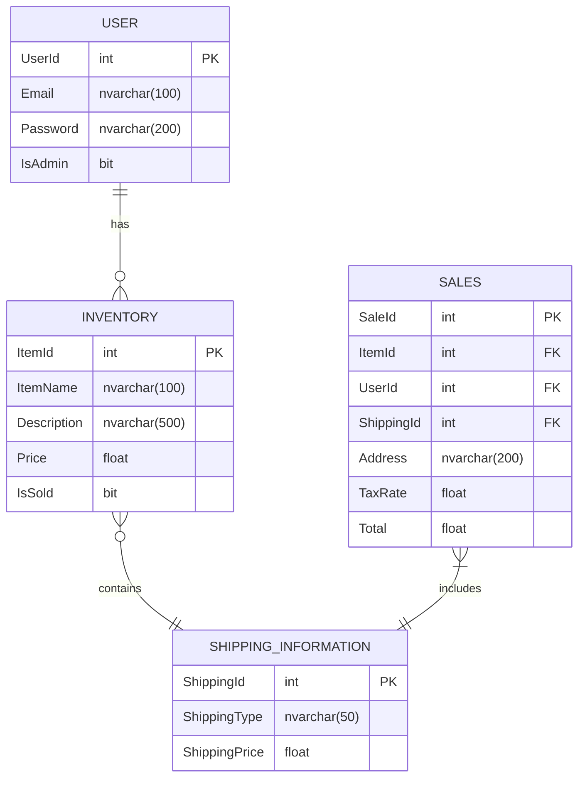

# Technical Design

## Table of Contents

- [Implementation Language(s)](#a-implementation-languages)
- [Implementation Framework(s)](#b-implementation-frameworks)
- [Data Storage Plan](#c-data-storage-plan)
- [Entity Relationship Diagram](#d-entity-relationship-diagram)
- [Entity/Field Descriptions](#e-entityfield-descriptions)
- [Data Examples](#f-data-examples)
- [Database Seed Data](#g-database-seed-data)
- [Authentication and Authorization Plan](#h-authentication-and-authorization-plan)
- [Coding Style Guide](#i-coding-style-guide)
- [Technical Design Presentation](#technical-design-presentation)

## A. Implementation Language(s)

### Language: Java

### Why Java?
- **Reliability:** It’s a stable, widely adopted language ideal for building scalable, high-traffic
web apps such as e-commerce platforms.
- **Strong typing:** Helps prevent runtime errors and supports secure data handling, which
is crucial for user authentication and payment processes.
- **Large ecosystem:** Integrates easily with Spring Boot, Maven, and SQLite libraries to
simply web app development
- **Cross-platform:** Runs on any system supporting the JVM
- **Productivity:** IDEs like intelliJ and tools like Maven improve build automation and
dependency management


### Use in Project
- Backend logic (controllers, services, models)
- Integration with Spring Boot for RESTful APIs and SQLite database access

### Documentation and Tutorials
- [Official Java Documentation](https://docs.oracle.com/en/java/)
- [W3Schools Java Tutorial](https://www.w3schools.com/java/)
- [GeeksforGeeks Java Tutorial](https://www.geeksforgeeks.org/java/java/#)

## B. Implementation Framework(s)

### Frontend Framework: Spring Boot

### Why Spring Boot?
- **Simple setup:** It autoconfigures common components/dependencies through Maven,
  allowing faster deployment
- **RESTful API support:** Makes it easy to create and consume REST APIs
- **Dependency Injection:**  Improves modularity and reduces coupling across
  services/controllers
- **Security:** Spring Security supports encrypted passwords and role-based authorization
- **Data management:** Works easily with Spring Data JPA for interacting with SQLite,
  reducing repetitive SQL code

### Use in Project
- Backend logic (controllers, services, models)
- REST API endpoints for handling registration, login, inventory retrieval, and order
processing
- Spring Data JPA for connection to SQLite database for the storage of users, items, and
orders
- Spring Security for password hashing and admin-only privileges

### Documentation and Tutorials
- [Official Spring Boot Documentation](https://docs.spring.io/spring-boot/docs/current/reference/htmlsingle/)
- [Spring Initializer (Setup)](https://start.spring.io/)
- [Baeldung Spring Boot Tutorial](https://www.baeldung.com/spring-boot)


---
### Frontend Framework: Bootstrap

### Why Bootstrap?
- **Responsive design:** Automatically adjusts layouts across different devices, ensuring
  consistency
- **Pre-built UI components:** Includes ready-to-use components such as buttons and
  forms for faster development
- **Fast prototyping:**  Enables fast frontend development without manually writing
  extensive CSS or JS for every element
- **Simple integration:** Easily works with backend frameworks like Spring Boot
- **Customization:**  Integrates with custom CSS and supports theming through variables

### Use in Project
- Grid layouts and responsive design for all frontend pages
- Consistent color palette and button styles across the app
- Form and alert components for user interactions

### Documentation and Tutorials
- [Official Bootstrap 5 Documentation](https://getbootstrap.com/docs/5.3/getting-started/introduction/)
- [Bootstrap Grid System Overview](https://getbootstrap.com/docs/5.3/layout/grid/)
- [Traversy Media Bootstrap Tutorial (YouTube)](https://www.youtube.com/watch?v=5GcQtLDGXy8)

## C. Data Storage Plan
We chose to use a SQLite database to have our application store our data. To access the SQLite database, we will be using the SQLite-JDBC driver for Java. 

To write and access our database we will:
1. Add the SQLite-JDBC dependency to our pom.xml file for Maven
2. Connect to the SQLite database using the JDBC URL string.
3. Create our tables with necessary seed data (if database is not found, meaning it's the programs first run)
4. Store Data using prepared statements for persistent inserts/updates
5. Retrieve Data by querying the database
6. Close Resources by closing connections to ensure data is flushed to the disk

We will ensure that the database is stored in a physical `.db` file on the disk, so any changes to the database persist. 

[Here](./DatabaseExample.java) is some example code for how we plan on modifying and accessing our database. The code shows how to perform each step listed above. 

Below are some article that show examples for how to access a SQLite database in Java using the SQLite-JDBC driver:
1. [Article 1](https://www.sqlitetutorial.net/sqlite-java/sqlite-jdbc-driver/)
2. [Article 2](https://www.tutorialspoint.com/sqlite/sqlite_java.htm)

## D. Entity Relationship Diagram



## E. Entity/Field Descriptions

### Users
| Property | Type                       | Default      | Nullable | Relationship | Notes                                |
|----------|----------------------------|--------------|----------|--------------|--------------------------------------|
| UserID   | int, identity, primary key | Identity(1,1)| No       |              | Unique identification for each user. |
| Email    | nvarchar(100)              |              | No       |              | User login email, unique.            |
| Password | nvarchar(200)              |              | No       |              | Hashed password.                     |
| IsAdmin  | bit                        | 0            | No       |              | 1 = Administrator 0 = User           |

### Inventory
| Property      | Type                       | Default      | Nullable | Relationship | Notes                                      |
|---------------|----------------------------|--------------|----------|--------------|--------------------------------------------|
| ItemID        | int, identity, primary key | Identity(1,1)| No       |              | Unique identification for each item.       |
| ItemName      | nvarchar(100)              |              | No       |              | Item name.                                 |
| ItemDescription| nvarchar(500)             |              | Yes      |              | Description of the item.                   |
| ItemPrice     | decimal(10,2)              |              | No       |              | Price of the item.                         |
| IsSold        | bit                        | 0            | No       |              | 0 = Not sold 1 = Sold                      |
| ItemPicture   | nvarchar(200)              |              | Yes      |              | Item image.                                |

### Sales
| Property  | Type                       | Default      | Nullable | Relationship                       | Notes                                             |
|-----------|----------------------------|--------------|----------|------------------------------------|---------------------------------------------------|
| SalesID   | int, identity, primary key | Identity(1,1)| No       |                                    | Unique identification for each sale/order.        |
| ItemID    | int, foreign key           |              | No       | Inventory.ItemID                   | Item in the sale.                                 |
| ShippingID| int, foreign key           |              | No       | ShippingInformation.ShippingID     | Shipping for the sale.                            |
| UserID    | int, foreign key           |              | No       | User.UserID                        | User who made the sale.                           |
| Address   | nvarchar(200)              |              | No       |                                    | Shipping Address.                                 |
| TaxRate   | Decimal(5,2)               |              | No       |                                    | Tax rate for the specific item.                   |
| Total     | decimal(10,2)              |              | No       |                                    | Total price of sale, including tax rate.          |

### Shipping Information
| Property      | Type                       | Default      | Nullable | Relationship | Notes                                        |
|---------------|----------------------------|--------------|----------|--------------|----------------------------------------------|
| ShippingID    | int, identity, primary key | Identity(1,1)| No       |              | Unique identification for each shipping created. |
| ShippingType  | nvarchar(50)               |              | No       |              | Overnight, 3-Day or Ground.                  |
| Speed         | int                        |              | No       |              | Days of shipping.                            |
| ShippingPrice | decimal(10,2)              |              | No       |              | Cost of the shipping.                        |


## F. Data Examples


## G. Database Seed Data

### Users
| UserID | Email              | Password         | IsAdmin |
|--------|--------------------|------------------|--------|
| 1      | admin@example.com  | AdminPassword123 | 1      |
| 2      | user@example.com   | UserPassword123  | 0      |

### Inventory
| ItemID | ItemName                         | Item Description                                                                                                                                                                                                                                                                                                                                 | ItemPrice | IsSold | ItemPicture        |
|--------|----------------------------------|---------------------------------------------------------------------------------------------------------------------------------------------------------------------------------------------------------------------------------------------------------------------------------------------------------------------------------------------------|----------|--------|--------------------|
| 1      | Master Sword - The Legend of Zelda | A legendary, sacred blade said to be “the sword that seals the darkness.” Only a true hero can wield it. The Master Sword is infused with divine power and is known for its ability to repel and even destroy evil, especially forces like Ganon.                                                                                                | 1,000.00 | 0      | ~/pictures/master_sword.png |
| 2      | Pikachu - Pokemon                | An Electric-type Pokémon known as the mascot of the series. Small yellow mouse with lightning-bolt tail and electric cheeks that can shock opponents.                                                                                                                                                                                            | 100.00   | 0      | ~/pictures/pikachu.png |
| 3      | Bulbasaur - Pokemon              | A Grass/Poison-type starter Pokémon with a plant bulb on its back. It soaks up sunlight and uses the energy stored in that bulb to grow.                                                                                                                                                                                                         | 90.00    | 0      | ~/pictures/bulbasaur.png |
| 4      | Pokeball - Pokemon               | The basic capture device used by Trainers. You throw it at a wild Pokémon to catch it and store it so you can use that Pokémon later.                                                                                                                                                                                                            | 50.00    | 0      | ~/pictures/pokeball.png |
| 5      | Raygun - Call of Duty            | A legendary, experimental wonder weapon said to “bend the laws of physics.” Only the bold can control it. The Ray Gun channels unstable cosmic energy, disintegrating the undead and tearing through anything foolish enough to stand in its path.                                                                                               | 125.00   | 0      | ~/pictures/raygun.png |
| 6      | Blue Spiny Shell - Super Mario   | A dreaded, heat-seeking menace said to “punish the one in first.” The Blue Spiny Shell locks onto the leader, soaring past everyone else before exploding in a storm of spikes and chaos, turning the race upside down in an instant.                                                                                                             | 95.00    | 0      | ~/pictures/blue_shiny_spell.png |

### Shipping Information
| ShippingID | ShippingType | Speed | ShippingPrice |
|------------|--------------|-------|---------------|
| 1          | Overnight    | 1     | 29.00         |
| 2          | 3-Day        | 3     | 19.00         |
| 3          | Ground       | 14    | 0.00          |

## H. Authentication and Authorization Plan

1. **Overview**  
   This e-commerce website uses Spring Boot, Spring Security and SQLite to handle both authentication and authorization. Authentication will verify the identity of the user attempting to access the system, while authorization determines the permissions the user has.  
   All users share a single login form. After a successful authentication, the system determines whether the user is a regular user or an administrator. The system will then grant the administrator the special administrator privelages. 

2. **Authentication**  
   The system uses Spring Security’s form-based login with a custom UserDetailsService to load user credentials and roles from the SQLite database.  

   **Process Flow:**  
   - The user submits their email and password through the shared login form.  
   - Spring Security verifies the user’s identity (email and password) who is attempting to access the system through the configured AuthenticationProvider.  
   - The custom UserDetailsService loads the user’s details including email, password, and role(s) from the SQLite database. This role information determines whether the user is a regular user or an administrator.  
   - The retrieved user details are returned to the AuthenticationProvider, which compares the provided information with the stored data.  
   - Upon successful validation Spring Security redirects the user to the dashboard corresponding to their role.  

3. **Authorization**  
   Once authenticated, the system checks the Granted Authorities associated with the currently authenticated user to authorize the user actions.  
   - **Users** can access and modify their own data including:  
     - Search the product inventory  
     - View and managing their shopping cart  
     - Adding or removing items from the shopping cart  
     - Checkout  
     - View their order history  
   - **Administrators** have all the permissions of a regular user, plus additional administrative privileges, such as:  
     - Viewing sales reports  
     - Exporting Sales Data  
     - Adding new inventory items  
     - Editing existing inventory  
     - Deleting inventory items

## I. Coding Style Guide

### Language: Java

### Naming Conventions

| Type          | Convention                  | Example                              |
|---------------|-----------------------------|--------------------------------------|
| **Classes**   | PascalCase                  | `InventoryController`, `UserService` |
| **Methods**   | camelCase                   | `getItemById()`, `calculateTotal()`  |
| **Variables** | camelCase                   | `userName`, `orderList`              |
| **Constants** | UPPER_CASE with underscores | `TAX_RATE`, `MAX_LOGIN_ATTEMPTS`     |
| **Packages**  | all lowercase               | `com.ecommerce.controllers`          |

### Commenting

- Use Javadoc (/** … */) for all public classes and methods, describing purpose, parameters, and return values.
```java
/**
 * Calculates total cost including sales tax.
 *
 * @param subtotal the price before tax
 * @return the final total including tax
 */
public double calculateTotal(double subtotal) {
    return subtotal * 1.06;
}
```
- Incline comments (// …) for complex logic or clarifying intent.

```java
// Prevent checkout if the cart is empty
if (cart.isEmpty()) {
    throw new IllegalStateException("Cart cannot be empty");
}
```

- Avoid redundant comments; the code should mostly explain itself.

### Formatting
- Indention: 4 spaces (no tabs).
- Line length: Max 100 characters.
- One blank line between methods.
- Use consistent brace style (K&R):

```java
if (condition) {
   // code
} else {
   // code
}
```
### Source Control
- Version control: GitHub
- Branching model: GitFlow
  - `main`: stable production code
  - `develop`: integration of latest features
  - `feature/<feature-name>`: new work
  - `bugfix/<issue>`: small corrections
- Commit messages should be descriptive and concise
  - `feat`: add user authentication logic
  - `fix`: resolve null pointer in checkout controller

### References
- [Cornell Java Style Guide](https://www.cs.cornell.edu/courses/JavaAndDS/JavaStyle.html)
- [Google Java Style Guide](https://google.github.io/styleguide/javaguide.html)


## Technical Design Presentation
